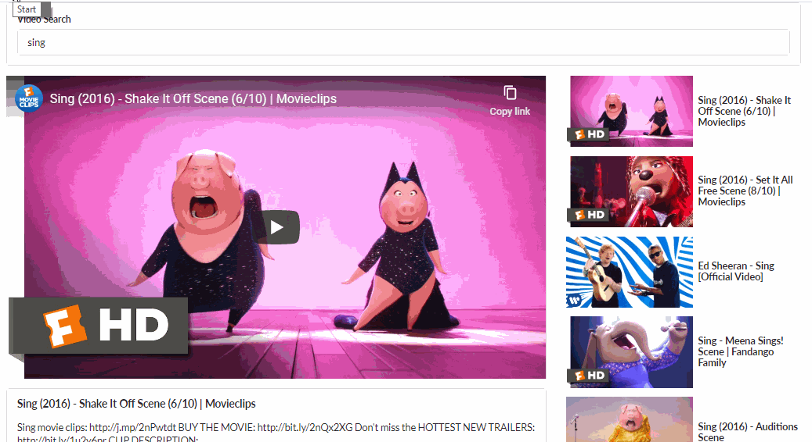

# Video Search Application

## Description

Created a new react project that has a search bar on the top and based on the search term, the youtube API is hit and we get the list of vidoes for that particular search term.

## Steps to run

- Clone the repository.
- There is an API key for the youtube API that you need to add in the api folder.
- `npm start` to run the application.

## React concepts

- Clear seperation of components.
- Ability to handle asynchronous operations in react using axios.
- Ability to handle form inputs.
- Ability to render lists in React.
- Ability to use iframe inside the application.
- Created a clean and functional code.

## Main Screen

